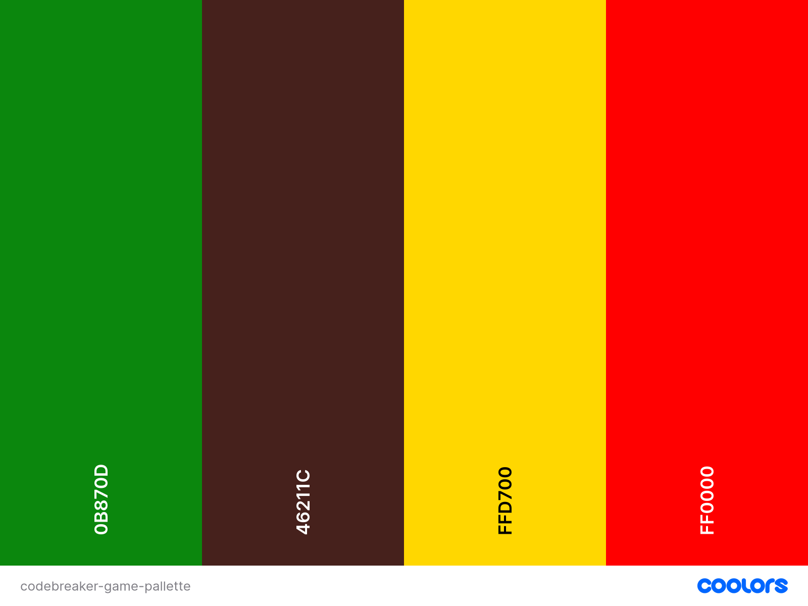

# Codebreaking Game
This is a computer codebreaking game similar to the paper and pencil game [bulls and cows](https://en.wikipedia.org/wiki/Bulls_and_cows) or [pigs and bulls](https://en.wikipedia.org/wiki/Bulls_and_cows) in that it uses digits for the code, the difference being that in the paper and pencil game digits must be all different, while in the computer version repetitions are permitted. In this aspect this game is more similar to the board game [Mastermind](https://en.wikipedia.org/wiki/Mastermind_(board_game)), which uses colours for the code and repetitions are permitted.

How it works:

A four digit code is generated by the computer; the player has ten tries to guess the code and after ten incorrect guesses the game is over. After each try, feedback is given in the form of a black dot for each correct digit in the right place, a white dot for each correct digit in the wrong place and an x for each incorrect digit.

This is a trial and error game which seeks to develop critical thinking and logical deduction. Players learn how to analyze clues, form hypotheses and recognize patterns.

## Table of Contents

### <a href="#ux">1. User Experience (UX)</a>
- <a href="#project-goals">Project Goals</a>
- <a href="#developer-goals">Developer Goals</a>
- <a href ="#user-stories">User Stories</a>

### <a href="#development">2. Development Life Cycle</a>

### <a href="#design">3. Design</a>
- <a href="#features">Features</a>
- Typography
- <a href="#colours">Colour Scheme</a>
- <a href="#wireframes">Wireframes</a>

### <a href="#technologies">4. Technologies Used</a>
- <a href="#languages">Languages Used</a>
- <a href="#frameworks">Frameworks, Libraries & Programs Used</a>

### <a href="#deployment-and-development">5. Deployment and Local Development</a>
- <a href="#deployment">Deployment</a>
- Local Development

### <a href="#testing">6. Testing</a>
- Full Testing
- Solved Bugs 
- Known Bugs
- <a href="#w3c">W3C Validation</a>
- JavaScript Validation
- Lighthouse
- Behaviour Driven Development and Testing User Stories
- Test Driven Development

### 7. Credits
- Code Used
- Content
- Media
- <a href="#documentation">Documentation</a>
- Acknowledgements

## <h2 id="ux">1. User Experience (UX)</h2>

### <h3 id="project-goals">Project Goals</h3>
The goal of this project is to deliver a responsive, fully-functional, critical thinking game, suitable for players of all ages. In its final stage it would target particularly a younger audience segment through its imagery, sounds and levels of difficulty (players could choose the number of numerals that can be used to form the 4 digit code, with as few as 2 numerals: 0 and 1 forming the easiest level). Young children could start playing this as a fun game of chance, only to realize that in order to win they need to start developing some thinking strategies. 

### <h3 id="developer-goals">Developer Goals</h3>
- to implement lessons learned from her previous project, especially to test more often, make smaller commits and write a better documentation;
- to apply the principles of Test Driven Development and Behaviour Driven Development;
- to deliver a real world application using HTML, CSS and JavaScript;
- to deliver an application that would be included in her portfolio;

### <h3 id="user-stories">User Stories</h3>
As a First-Time Player, I need:
1. an intuitive design, so that I can start playing the game quickly, without frustration;
2. to easily find instructions for the game, so that I know how to play it;

As a Player, I need:
1. a responsive layout, so that I can play the game on different devices;
2. a Play button, so that I can start playing the game;
3. an input area, so that I can attempt breaking the code;
4. to be given warning messages for incorrect input type, so that I can correct that before submitting;
5. feedback for my guess, to know how close I am to breaking the code;
6. to see all my previous tries displayed, so that I can compare them and think about the solution;
7. to know how many tries I have left, to adopt the best strategy in the given situation;
8. a replay button, so that I can play a new game after finishing the previous one;

As a Player, I would like:
1. to have beautiful images and possibly a story associated with the game, to make my playing experience more interesting;
2. to have a reward for winning the game, so that I enjoy it and continue to play it;
3. to have something happening when I lose the game, so that I have fun;
4. to have sounds associated with the game, to enhance the playing experience;
5. to have the options of enabling/ disabling sounds, so that can choose the one I want;
6. to be able to select the level of difficulty, so that I can choose the one that suits my abilities;

As a developer, I want:
1. to experiment a test driven approach at least for the basic functionality of this game, so that I have a better understanding of this process and how to apply it in a project;

## <h2 id="development">2. Development Life Cycle</h2>

This game is going to be developed in several phases and with a mobile first, functionality first mindset. 
The first phase aims to deliver the MVP, a fully functional game with only strictly necessary features.

## <h2 id="design">3. Design</h2>

### <h3 id="features">Features</h3>
In the first phase there will be minimal features: a heading, a feedback section and a playing section. The playing section will include: the input fields, the submit button and the play button.

### <h3 id="colours">Colour Scheme</h3>
As the game in its final form would ideally include the images of a sleeping dragon and a locked treasure chest, for the MVP I chose a colour pallette inspired by these images: "dragon-green"= #0B870D, "chest-brown"= #46211C, "treasure-gold"= #FFD700, and "contrast-red"= #FF0000. It's very likely that I will change the colours on the way, but it's something to start with.

### <h3 id="wireframes">Wireframes</h3>
[First phase wireframes](readme-assets/first-phase/first-phase-wireframe.png)

## <h2 id="technologies">4. Technologies Used</h2>
### <h3 id="languages">Languages Used</h3>
HTML has been used to shape the skeleton of the game page.

### <h3 id="frameworks">Frameworks, Libraries & Programs Used</h3>

Git - for version control;

Github - to save and store the files for the game;

https://coolors.co/ for creating the colour pallette;

## <h2 id="deployment-and-development">5. Deployment and Local Development
### <h3 id="deployment">Deployment</h3>

The live website was deployed using GitHub Pages at: <a href="https://veronicateodorof.github.io/code-breaking-game/">https://veronicateodorof.github.io/code-breaking-game/</a> 

Instructions on how to achieve this can be found below:

1. Log into your GitHub account (or sign up if you don't have one).
2. Go to the repository for this project: <a href="https://github.com/VeronicaTeodorof/code-breaking-game/">https://github.com/VeronicaTeodorof/code-breaking-game</a>.
3. Click on the Settings link on the right hand side of the top navigation bar.
4. In the left hand side navigation bar click on the Pages link.
5. Under the Build and deployment header, in the Source section, select main branch from the dropdown menu. Make sure Root is selected in the dropdown select folder menu.
6. Click Save. The live GitHub Pages website is now deployed at the URL shown.

## <h2 id="testing">6. Testing</h2>
### <h3 id="w3c">W3C Validation</h3>
First phase:

Initial validation of the HTML boilerplate shows two errors: [initial HTML boilerplate validation](readme-assets/first-phase/W3C-initial-test-HTMLboilerplate.png)

Lesson learned: validate  and check before committing.

The errors have been corrected and the HTML boilerplate has been validated: [validation of HTML boilerplate](readme-assets/first-phase/html-boilerplate-validated.png)

## <h2 id="credits2">7. Credits</h2>
### <h3 id="documentation">Documentation</h3>

While trying to understand what intuitive design for a game means, and what the acceptance criteria and tasks whould be in order to meet this user story, I realized that I need to add another user story, the one about input validation, because no player wants to be allowed to enter invalid data type, but they want to be warned about that, and easily correct the mistake. So this user story is written with the help of AI overview for "acceptance criteria for intuitive design of a game".